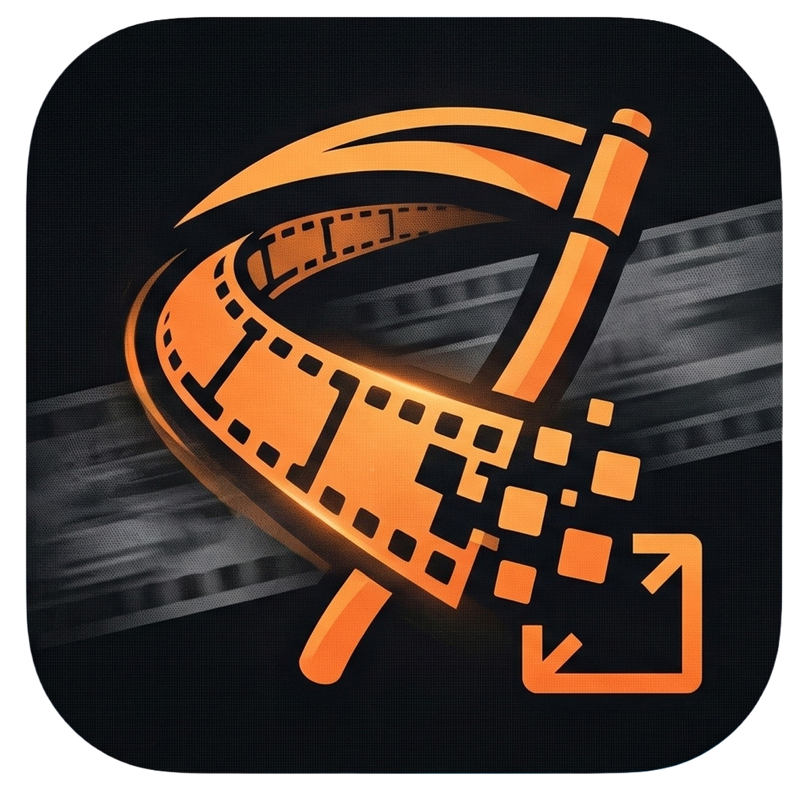

<a id="top"></a>

<div align="center">



# LoRA-Harvester v3.0

### AI-Powered Video → LoRA Training Dataset Creator
### Yapay Zeka Destekli Video → LoRA Eğitim Dataseti Oluşturucu

[](https://www.python.org/downloads/)
[](https://pytorch.org/)
[](LICENSE.txt)
[](https://github.com/AllastorV)

**[English](#english) | [Türkçe](#turkce)**

</div>

---

<a name="english"></a>

## ENGLISH

### What's New in v3.0

- 🧩 **Caption Studio** — one page for both auto-generation (WD14) and manual editing, with live Danbooru tag autocomplete while you type
- 🎯 **Quality presets** — pick *High Accuracy / Balanced / High Speed*; the best WD14 model, confidence, and tag count are chosen for you
- 🔖 **Trigger + Suffix** — prepend a LoRA keyword *and* append quality tokens in the same UI
- 🖼️ **Florence-2** — optional natural-language captions for full-sentence alt-text
- ✂️ **SAM2 + PySceneDetect** — subject-aware masking and cut-level deduplication
- 🎨 **Dark / Light theme** + font scaling + differentiated Start/Pause/Skip/Stop buttons

### What Is It?

LoRA-Harvester extracts high-quality frames from videos, sorts them by character using face recognition, and optionally generates captions — producing a clean, ready-to-train LoRA dataset in minutes instead of hours.

**Main workflow:**
```
Video(s) → Extract frames → AI detects person → Smart crop → Quality filter → Caption → Dataset
```

**Character Sorter workflow:**
```
Image folder → Face detection → Match / cluster by identity → Sort into named folders
```

---

### Features

| Feature | Details |
|---------|---------|
| AI Detection | YOLOv8 single-model detector (fast, modern replacement for the old 3-model ensemble) |
| Scene Detection | Optional PySceneDetect integration — skips duplicate-ish content between cuts |
| Smart Crop | Aspect-ratio aware crop with configurable padding, SAM2-assisted subject masking |
| Overlay Awareness | Detects logos/watermarks and crops around them |
| Quality Filter | Blur, noise, brightness, and duplicate detection |
| Character Sorter | InsightFace face recognition to sort images by character identity |
| Max Characters | Limit output to 1–6 character folders; extras go to `other/` |
| Caption Studio | Single page merging **Generate** (WD14 tagging) + **Edit** (Danbooru autocomplete) |
| Tagging Presets | One-click `High Accuracy / Balanced / High Speed` — auto-picks the best WD14 model |
| Trigger + Suffix | Prepend a LoRA keyword *and* append quality tokens in one place |
| Natural-Language | Optional Florence-2 captions for descriptive, full-sentence alt-text |
| Tag Frequency | Scan a caption folder, count tag usage, bulk-remove unwanted tags across files |
| xformers | Opt-in memory-efficient attention for Florence-2 / SAM2 on supported GPUs |
| Turbo Mode | Batch frame processing for maximum throughput |
| Checkpoint | Resume interrupted processing from where it stopped |
| Bilingual UI | English / Turkish interface, full dark/light theme switching |

---

### Installation

```bash
# 1. Clone the repository
git clone https://github.com/AllastorV/LoRA-Harvester.git
cd LoRA-Harvester

# 2. Create a virtual environment
python -m venv venv
source venv/bin/activate        # Linux / Mac
venv\Scripts\activate           # Windows

# 3. Install dependencies
pip install -r requirements.txt

# 4. Launch
python main.py
```

> **GPU support:** Install PyTorch with CUDA before installing other requirements.
> See https://pytorch.org/get-started/locally/

---

### Launching

| Method | Description |
|--------|-------------|
| `python main.py` | Standard launch with console output |
| `run.bat` | Windows launcher — closes the CMD window after startup |
| `run_silent.vbs` | Fully silent launch — no window at all (double-click) |

---

### Usage

#### GUI Mode

```bash
python main.py
```

1. **Step 1** — Drop video file(s) or select a folder
2. **Step 2** — Configure settings (format, interval, model, quality, captions)
3. **Step 3** — Click **Start** and monitor the log

#### CLI Mode

```bash
# Basic
python scripts/cli.py video.mp4

# Common options
python scripts/cli.py video.mp4 -f 1:1 -i 15 -c 0.7 --quality --ensemble --turbo

# With captions
python scripts/cli.py video.mp4 --caption --caption-mode combined --trigger "mychar"

# Character sort
python scripts/character_sort.py /images/input --references /refs --max-characters 2
```

---

### Settings Reference

#### Video Extractor

| Parameter | Default | Description |
|-----------|---------|-------------|
| `--format -f` | `9:16` | Crop aspect ratio. `1:1` is best for LoRA; `9:16` for vertical content |
| `--interval -i` | `30` | Process every N frames. Lower = more frames, slower |
| `--confidence -c` | `0.5` | Detection threshold (0.1–0.95). Higher = fewer but cleaner detections |
| `--padding -p` | `500` | Min pixels of context around the detected subject |
| `--model -m` | `yolov8n` | YOLO size: `n`=fast, `s`=balanced, `m/l`=accurate |
| `--turbo` | ON | Batch frame processing. Keep ON unless VRAM is very low |
| `--batch-size` | `4` | Frames per batch in turbo mode (1–16) |
| `--ensemble` | OFF | Use 3 AI models and vote for agreement. Slower but more accurate |
| `--voting-threshold` | `2` | How many models must agree (1–3). `3` = strictest |
| `--quality` | OFF | Enable blur + noise + brightness + duplicate filtering |
| `--caption` | OFF | Generate a `.txt` caption file per saved image |
| `--trigger` | *(empty)* | Word prepended to every caption (your LoRA keyword) |
| `--suffix` | *(empty)* | Tags appended at the end of every caption (quality tokens etc.) |
| `--max-tags` | `30` | Maximum Danbooru tags per caption |
| `--negative-tags` | *(none)* | Comma-separated tags to always exclude |
| `--preset` | *(none)* | Tagging preset: `anime_character`, `style_lora`, `realistic_photo`, `concept_art` |

#### config.yaml — Advanced

```yaml
quality:
  blur_threshold: 100.0       # Min sharpness score. Higher = stricter
  noise_threshold: 12.0       # Max grain level. Lower = stricter
  brightness_min: 40          # Darkest allowed frame (0–255)
  brightness_max: 220         # Brightest allowed frame (0–255)
  duplicate_threshold: 0.92   # Similarity cutoff (0–1). Higher = keep more

overlay:
  sensitivity: "normal"       # "low" / "normal" / "high"
  margin_px: 15               # Clearance pixels around detected overlay

captioning:
  wd14:
    min_confidence: 0.35      # Min tag confidence (0–1)
    max_tags: 30              # Max tags per caption
  florence2:
    model: "microsoft/Florence-2-base"   # "-base" (fast) or "-large" (accurate)
    task: "<MORE_DETAILED_CAPTION>"
```

#### Character Sorter

| Parameter | Default | Description |
|-----------|---------|-------------|
| `--model` | `buffalo_l` | InsightFace model. `buffalo_l`=accurate, `buffalo_s`=fast |
| `--threshold` | `0.45` | Face similarity cutoff (0–1). Lower = stricter matching |
| `--max-characters` | `1` | Limit output to 1–6 character folders. Extras go to `other/` |
| `--cluster-eps` | `0.6` | DBSCAN epsilon for auto-clustering unknown faces |
| `--cluster-min` | `2` | Minimum images to form a cluster. Below this goes to `unknown/` |
| `--no-cluster` | OFF | Disable auto-clustering; unmatched faces go to `unknown/` |
| `--copy` | OFF | Copy files instead of moving them |
| `--recursive` | OFF | Also scan sub-directories |

**Output structure:**
```
_sorted/
├── character_name/   ← matched to reference images
├── character_01/     ← auto-clustered unknown group
├── other/            ← overflow when max_characters limit reached
├── unknown/          ← could not form a cluster
├── no_face/          ← no face detected
└── multi_face/       ← multiple faces, no clear match
```

---

### Quick Presets

| Goal | Command |
|------|---------|
| Best LoRA dataset | `python scripts/cli.py video.mp4 -f 1:1 -i 15 -c 0.7 --ensemble --turbo --quality` |
| Fast collection | `python scripts/cli.py video.mp4 -f 1:1 -i 50 --turbo` |
| Maximum quality | `python scripts/cli.py video.mp4 -f 1:1 -i 10 --ensemble --voting-threshold 3 --quality` |
| Vertical content | `python scripts/cli.py video.mp4 -f 9:16 -i 30 --turbo` |
| With captions | `python scripts/cli.py video.mp4 -f 1:1 --caption --preset anime_character --trigger "mychar" --suffix "masterpiece, best quality"` |

---

### Troubleshooting

| Problem | Solution |
|---------|---------|
| CUDA out of memory | Lower `--batch-size` or use `--no-turbo` |
| Too few frames extracted | Lower `--interval` or `--confidence` |
| Too many false detections | Raise `--confidence`, use `--ensemble` |
| Captions only contain trigger word | WD14 model failed to load — run `pip install onnxruntime` (or `onnxruntime-gpu`) and ensure you have internet access on first launch so the model can download |
| Captions not generating | Run `pip install onnxruntime` |
| Watermarks in output | Enable quality filter; set `overlay.sensitivity: "high"` in config.yaml |
| Grainy or dark frames | Enable `--quality`; lower `noise_threshold` in config.yaml |
| InsightFace missing | Run `pip install insightface scikit-learn onnxruntime` |

---

### Project Structure

```
LoRA-Harvester/
├── main.py                       # GUI entry point
├── run.bat                       # Windows launcher (CMD closes after start)
├── run_silent.vbs                # Silent launcher (no window)
├── config.yaml                   # Advanced configuration
├── requirements.txt
├── assets/
│   └── icon.png                  # Application icon
├── src/
│   ├── core/
│   │   ├── unified_processor.py   # Main video processing engine
│   │   ├── character_recognizer.py
│   │   ├── advanced_captioner.py  # WD14 / Danbooru tagger
│   │   ├── florence2_captioner.py # Natural-language captions
│   │   ├── sam2_masker.py         # SAM2 subject masking (optional)
│   │   ├── scene_detector.py      # PySceneDetect cut detection (optional)
│   │   ├── tag_autocomplete.py    # Danbooru tag loader for autocomplete
│   │   └── xformers_utils.py
│   └── ui/
│       ├── main_window.py
│       ├── caption_studio_page.py # Generate + Edit tabs, Danbooru autocomplete
│       ├── character_sort_page.py
│       ├── tag_frequency_page.py
│       ├── translations.py
│       └── theme.py
├── scripts/
│   ├── cli.py                    # Command-line interface
│   ├── character_sort.py         # Character sorter CLI
│   ├── check_gpu.py              # GPU diagnostics
│   ├── install.bat
│   ├── install_gpu.bat
│   └── run_batch.bat
└── docs/
    ├── CHANGELOG.md
    ├── QUICKSTART.md
    ├── OPTIMIZATION.md
    ├── ENSEMBLE.md
    └── SECURITY.md
```

---

<a name="turkce"></a>

## TURKCE

### v3.0'da Yenilikler

- 🧩 **Altyazi Studyosu** — otomatik uretim (WD14) ve manuel duzenleme tek sayfada; yazarken canli Danbooru etiket oneri
- 🎯 **Kalite onayarlari** — *Yuksek Dogruluk / Dengeli / Yuksek Hiz* sec, model ve degerler otomatik ayarlanir
- 🔖 **Tetikleyici + Sonek** — hem LoRA anahtar kelimesi bastan hem kalite tokenlari sondan ayni ekranda
- 🖼️ **Florence-2** — istege bagli, tam cumleli dogal dil aciklamalar
- ✂️ **SAM2 + PySceneDetect** — nesne odakli maskeleme ve kesim-seviyesinde tekrar azaltma
- 🎨 **Karanlik / Aydinlik tema** + yazi tipi olcekleme + ayri Baslat/Duraklat/Atla/Durdur butonlari

### Ne Ise Yarar?

LoRA-Harvester, videolardan yuksek kaliteli kareler cikarir, yuz tanima ile bunlari karaktere gore siralar ve istege bagli olarak caption uretir. Saatlerce suren manuel islemi dakikalar icinde tamamlayarak egitime hazir bir LoRA dataseti olusturur.

**Ana akis:**
```
Video(lar) → Kare cikar → AI kisi tespiti → Akilli kirp → Kalite filtresi → Caption → Dataset
```

**Karakter Siralayici akisi:**
```
Gorsel klasoru → Yuz tespiti → Kimlige gore eslestir/kumele → Isimli klasorlere sirala
```

---

### Ozellikler

| Ozellik | Detay |
|---------|-------|
| AI Tespiti | YOLOv8 tek model dedektor (eski 3 model ensemble yerine hizli ve modern) |
| Sahne Tespiti | Istege bagli PySceneDetect — kesimler arasi tekrar karelerini atlar |
| Akilli Kirpma | En-boy orani korumali kirpma, SAM2 destekli nesne maskeleme |
| Overlay Farkindaligi | Logo/filigran tespit eder, etrafindan kirpar |
| Kalite Filtresi | Bulaniklik, gurultu, parlaklik, tekrar tespiti |
| Karakter Siralayici | InsightFace ile yuz tanima ve karakter siralamа |
| Maks Karakter | Ciktiyi 1-6 karakter klasoruyle sinirla; fazlasi `other/`'a gider |
| Altyazi Studyosu | Tek sayfada **Olustur** (WD14) + **Duzenle** (Danbooru otomatik tamamlama) |
| Etiketleme Onayarlari | Tek tikla `Yuksek Dogruluk / Dengeli / Yuksek Hiz` — en iyi modeli otomatik secer |
| Tetikleyici + Sonek | Bas icin LoRA kelimesi *ve* son icin kalite tokenlari ayni yerde |
| Dogal Dil | Istege bagli Florence-2 — acik, tam cumleli aciklamalar |
| Etiket Sikligi | Altyazi klasorunu tara, etiket sayimlari uret, toplu temizle |
| xformers | Destekleyen GPU'larda Florence-2 / SAM2 icin bellek-tasarruflu dikkat |
| Turbo Mod | Toplu kare isleme ile maksimum hiz |
| Checkpoint | Yariдa kesilen islemi devam ettir |
| Iki Dilli Arayuz | Turkce / Ingilizce, tam karanlik/aydinlik tema |

---

### Kurulum

```bash
# 1. Klonla
git clone https://github.com/AllastorV/LoRA-Harvester.git
cd LoRA-Harvester

# 2. Sanal ortam olustur
python -m venv venv
source venv/bin/activate        # Linux / Mac
venv\Scripts\activate           # Windows

# 3. Bagımliliklari kur
pip install -r requirements.txt

# 4. Basla
python main.py
```

> **GPU destegi:** Diger gereksinimleri kurmadan once PyTorch'u CUDA ile kur.
> Bkz. https://pytorch.org/get-started/locally/

---

### Baslатma Yontemleri

| Yontem | Aciklama |
|--------|----------|
| `python main.py` | Konsol ciktisi ile standart baslатма |
| `run.bat` | Windows baslayicisi — uygulama actiktan sonra CMD penceresi kapanir |
| `run_silent.vbs` | Tamamen sessiz baslатма — hic pencere acinmaz (cift tiklа) |

---

### Kullanim

#### Arayuz (GUI) Modu

```bash
python main.py
```

1. **Adim 1** — Video dosya(lari) sürükle-birak ya da klasor sec
2. **Adim 2** — Ayarlari yapilandir (format, aralik, model, kalite, caption)
3. **Adim 3** — **Baslat**'a tikla, logu izle

#### Komut Satiri (CLI) Modu

```bash
# Temel kullanim
python scripts/cli.py video.mp4

# Yaygin secenekler
python scripts/cli.py video.mp4 -f 1:1 -i 15 -c 0.7 --quality --ensemble --turbo

# Caption ile
python scripts/cli.py video.mp4 --caption --caption-mode combined --trigger "karakterim"

# Karakter siralayici
python scripts/character_sort.py /gorseller/giris --references /referanslar --max-characters 2
```

---

### Ayar Referansi

#### Video Cikarici

| Parametre | Varsayilan | Etkisi |
|-----------|-----------|--------|
| `--format -f` | `9:16` | Kirpma en-boy orani. `1:1` LoRA icin ideal; `9:16` dikey icerik |
| `--interval -i` | `30` | Her N karede bir isle. Dusuk = daha fazla kare, yavas |
| `--confidence -c` | `0.5` | Tespit esigi (0.1-0.95). Yuksek = az ama temiz tespit |
| `--padding -p` | `500` | Nesne etrafindaki min piksel bosluk |
| `--model -m` | `yolov8n` | YOLO boyutu: `n`=hizli, `s`=dengeli, `m/l`=dogru |
| `--turbo` | ACIK | Toplu kare isleme. VRAM cok dusuk degilse acik birak |
| `--batch-size` | `4` | Turbo modunda grup basina kare sayisi (1-16) |
| `--ensemble` | KAPALI | 3 AI modeli kullan ve oylama yap. Yavas ama cok dogru |
| `--voting-threshold` | `2` | Kac model anlasмali (1-3). `3` = en kati |
| `--quality` | KAPALI | Bulaniklik + gurultu + parlaklik + tekrar filtrelemeyi ac |
| `--caption` | KAPALI | Her gorsel icin `.txt` caption dosyasi olustur |
| `--trigger` | *(bos)* | Her caption'in basina eklenen kelime (LoRA anahtar kelimen) |
| `--suffix` | *(bos)* | Caption sonuna eklenen etiketler (kalite tokenlari vb.) |
| `--max-tags` | `30` | Caption basina maksimum Danbooru etiketi |
| `--negative-tags` | *(yok)* | Her zaman haric tutulacak etiketler (virgülle ayrilmis) |
| `--preset` | *(yok)* | Etiketleme onayari: `anime_character`, `style_lora`, `realistic_photo`, `concept_art` |

#### Karakter Siralayici

| Parametre | Varsayilan | Etkisi |
|-----------|-----------|--------|
| `--model` | `buffalo_l` | InsightFace modeli. `buffalo_l`=dogru, `buffalo_s`=hizli |
| `--threshold` | `0.45` | Yuz benzerligi siniri (0-1). Dusuk = daha kati eslestirme |
| `--max-characters` | `1` | Ciktıyi 1-6 karakter klasoruyle sinirla. Fazlasi `other/`'a |
| `--cluster-eps` | `0.6` | Bilinmeyen yuzler icin DBSCAN epsilon |
| `--cluster-min` | `2` | Kume olusturmak icin gereken min gorsel sayisi |
| `--no-cluster` | KAPALI | Otomatik kumelemeyi kapat; eslesmeyenler `unknown/`'a |
| `--copy` | KAPALI | Dosyalari tasimak yerine kopyala |
| `--recursive` | KAPALI | Alt klasorleri de tara |

---

### Hizli Onayarlar

| Hedef | Komut |
|-------|-------|
| En iyi LoRA dataseti | `python scripts/cli.py video.mp4 -f 1:1 -i 15 -c 0.7 --ensemble --turbo --quality` |
| Hizli toplama | `python scripts/cli.py video.mp4 -f 1:1 -i 50 --turbo` |
| Maksimum kalite | `python scripts/cli.py video.mp4 -f 1:1 -i 10 --ensemble --voting-threshold 3 --quality` |
| Dikey icerik | `python scripts/cli.py video.mp4 -f 9:16 -i 30 --turbo` |
| Caption ile | `python scripts/cli.py video.mp4 -f 1:1 --caption --preset anime_character --trigger "karakterim" --suffix "masterpiece, best quality"` |

---

### Sorun Giderme

| Sorun | Cozum |
|-------|-------|
| CUDA bellek hatasi | `--batch-size` dusur veya `--no-turbo` kullan |
| Cok az kare cikti | `--interval` veya `--confidence` degerini dusur |
| Cok fazla yanlis tespit | `--confidence` yukselт, `--ensemble` kullan |
| Sadece tetikleyici kelime yaziliyor | WD14 modeli yuklenmemis — `pip install onnxruntime` (veya `onnxruntime-gpu`) calistir ve ilk baslatmada internet baglantisi oldugundan emin ol |
| Caption olusmuyor | `pip install onnxruntime` calistir |
| Ciktida filigran var | Kalite filtresini ac; `config.yaml`'da `overlay.sensitivity: "high"` yap |
| Karlı/karanlik kareler | `--quality` ac; `config.yaml`'da `noise_threshold` degerini dusur |
| InsightFace eksik | `pip install insightface scikit-learn onnxruntime` calistir |

---

### Proje Yapisi

```
LoRA-Harvester/
├── main.py                       # GUI giris noktasi
├── run.bat                       # Windows baslayicisi (CMD kapanir)
├── run_silent.vbs                # Sessiz baslayici (pencere yok)
├── config.yaml                   # Gelismis yapilandirma
├── requirements.txt
├── assets/
│   └── icon.png                  # Uygulama ikonu
├── src/
│   ├── core/
│   │   ├── unified_processor.py
│   │   ├── character_recognizer.py
│   │   ├── advanced_captioner.py   # WD14 / Danbooru etiketleyici
│   │   ├── florence2_captioner.py  # Dogal dil aciklamalar
│   │   ├── sam2_masker.py          # SAM2 maske (istege bagli)
│   │   ├── scene_detector.py       # PySceneDetect (istege bagli)
│   │   ├── tag_autocomplete.py     # Otomatik tamamlama icin etiket yukleyici
│   │   └── xformers_utils.py
│   └── ui/
│       ├── main_window.py
│       ├── caption_studio_page.py  # Olustur + Duzenle sekmeleri
│       ├── character_sort_page.py
│       ├── tag_frequency_page.py
│       ├── translations.py
│       └── theme.py
├── scripts/
│   ├── cli.py                    # Komut satiri arayuzu
│   ├── character_sort.py         # Karakter siralayici CLI
│   ├── check_gpu.py              # GPU tani araci
│   ├── install.bat
│   ├── install_gpu.bat
│   └── run_batch.bat
└── docs/
    ├── CHANGELOG.md
    ├── QUICKSTART.md
    ├── OPTIMIZATION.md
    ├── ENSEMBLE.md
    └── SECURITY.md
```

---

<div align="center">

GPL v3 License &nbsp;|&nbsp; [GitHub](https://github.com/AllastorV/LoRA-Harvester) &nbsp;|&nbsp; [Issues](https://github.com/AllastorV/LoRA-Harvester/issues)

Star the repo if you find it useful!

</div>
